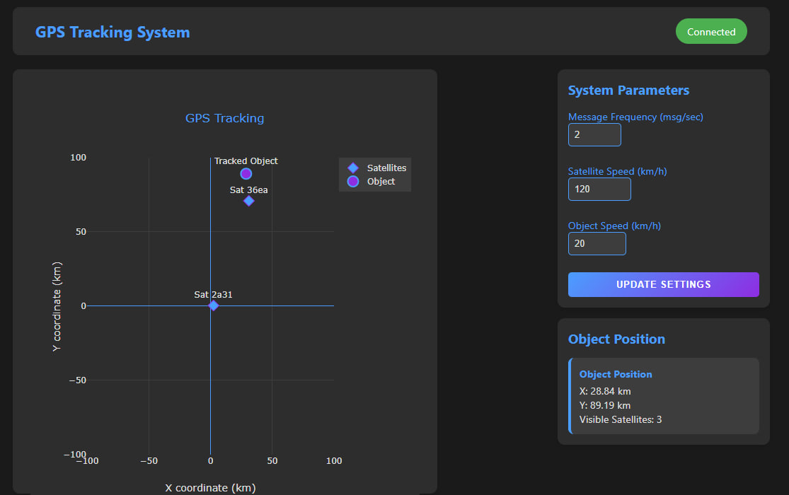
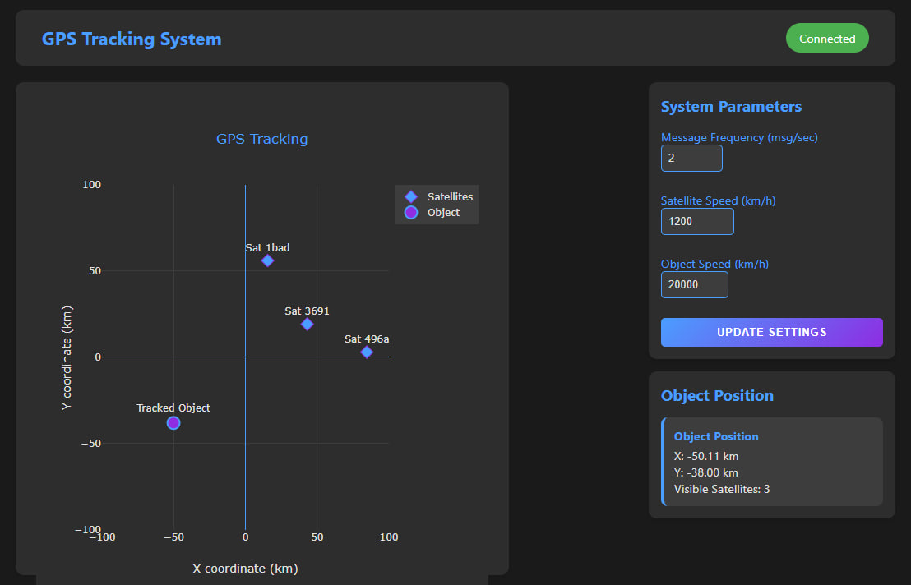

### Лабораторна робота №5
### Розробка додатку для візуалізації вимірювань GPS

Codepen: https://codepen.io/Min-Max_Reid/pen/MWNxKgG

###Мета роботи
Розробити додаток для зчитування даних з емульованої вимірювальної частини GPS, наданої у вигляді Docker image, та візуалізації положення об'єкта і супутників на графіку в декартових координатах.

###Теоретичні відомості
1. Трилатерація
Трилатерація - це метод визначення положення об'єкта у просторі шляхом вимірювання відстані до трьох або більше точок з відомими координатами. Основні принципи:

У двовимірному просторі потрібно мінімум три відомі точки
У тривимірному просторі - мінімум чотири точки
Кожна відома відстань розглядається як радіус кола (2D) або сфери (3D)
Положення об'єкта визначається точкою перетину цих кіл або сфер

2. Розрахунок положення об'єкта
Для визначення положення об'єкта використовується система рівнянь кіл:

Для кожної точки (x₁,y₁), (x₂,y₂), (x₃,y₃) з відстанями r₁, r₂, r₃
Обчислюються параметри A, B, C для кожної пари рівнянь
Знаходяться координати шуканої точки через розв'язання системи рівнянь

### Завдання до виконання

**1. Налаштування середовища:**
- Завантажити Docker image `iperekrestov/university:gps-emulation-service`
- Запустити контейнер на порту 4001
- Налаштувати підключення до WebSocket

**2. Розробка веб-додатку:**
- Створити інтерфейс для відображення даних GPS
- Реалізувати підключення до WebSocket серверу для отримання даних
- Розробити систему відображення даних у декартових координатах

**3. Функціональні вимоги:**
- Відображення позицій супутників та об'єкта на графіку
- Можливість зміни параметрів системи через API:
 * Розмір зони емуляції
 * Частота передачі повідомлень
 * Швидкість руху супутників
 * Швидкість руху об'єкта
- Обробка та візуалізація даних у реальному часі

### Розробка додатку

``` html
<!DOCTYPE html>
<html lang="en">
<head>
    <meta charset="UTF-8">
    <title>GPS Tracking System</title>
    <script src="https://cdnjs.cloudflare.com/ajax/libs/plotly.js/2.27.1/plotly.min.js"></script>
    <link rel="stylesheet" href="styles.css">
</head>
<body>
    <div class="app-container">
        <header class="app-header">
            <h1>GPS Tracking System</h1>
            <div id="connection-status">Disconnected</div>
        </header>

        <div class="main-content">
            <div class="plot-container">
                <section class="visualization-panel">
                    <div id="gps-plot"></div>
                </section>
            </div>

            <aside class="control-sidebar">
                <div class="settings-card">
                    <h2>System Parameters</h2>
                    <div class="settings-form">
                        <div class="form-group">
                            <label for="message-frequency">Message Frequency (msg/sec)</label>
                            <input type="number" id="message-frequency" value="2" min="1" max="10">
                        </div>
                        
                        <div class="form-group">
                            <label for="satellite-speed">Satellite Speed (km/h)</label>
                            <input type="number" id="satellite-speed" value="120" min="10" max="1000">
                        </div>
                        
                        <div class="form-group">
                            <label for="object-speed">Object Speed (km/h)</label>
                            <input type="number" id="object-speed" value="20" min="1" max="200">
                        </div>

                        <button id="update-settings" class="primary-button">
                            Update Settings
                        </button>
                    </div>
                </div>

                <div class="data-card">
                    <h2>Object Position</h2>
                    <div id="object-info" class="position-info"></div>
                </div>
            </aside>
        </div>
    </div>
    <script src="script.js"></script>
</body>
</html>
```

``` css
* {
    margin: 0;
    padding: 0;
    box-sizing: border-box;
}

body {
    font-family: 'Segoe UI', Tahoma, Geneva, Verdana, sans-serif;
    background: #1a1a1a;
    color: #e0e0e0;
    min-height: 100vh;
}

.app-container {
    max-width: 1100px;
    margin: 0 auto;
    padding: 15px;
}

.app-header {
    display: flex;
    justify-content: space-between;
    align-items: center;
    padding: 1rem 2rem;
    background: #2d2d2d;
    border-radius: 10px;
    margin-bottom: 20px;
}

.app-header h1 {
    color: #4a9eff;
    font-size: 1.4em;
}

#connection-status {
    padding: 8px 16px;
    border-radius: 20px;
    font-size: 0.9em;
    background: #f44336;
    color: white;
}

#connection-status.connected {
    background: #4CAF50;
}

.main-content {
    display: grid;
    grid-template-columns: auto 300px;
    gap: 15px;
}

.plot-container {
    width: 600px;
    height: 600px;
}

.visualization-panel {
    background: #2d2d2d;
    border-radius: 10px;
    padding: 25px;
    height: 100%;
    box-shadow: 0 4px 6px rgba(0, 0, 0, 0.1);
}

.control-sidebar {
    display: flex;
    flex-direction: column;
    gap: 15px;
    height: fit-content;
}

.settings-card, .data-card {
    background: #2d2d2d;
    padding: 15px;
    border-radius: 10px;
    box-shadow: 0 4px 6px rgba(0, 0, 0, 0.1);
}

h2 {
    color: #4a9eff;
    margin-bottom: 15px;
    font-size: 1.2em;
}

.settings-form {
    display: flex;
    flex-direction: column;
    gap: 12px;
}

.form-group {
    margin-bottom: 12px;
}

.form-group label {
    display: flex;
    flex-direction: column;
    gap: 6px;
    color: #4a9eff;
    font-size: 0.9em;
}

.form-group input {
    padding: 8px;
    background: #3d3d3d;
    border: 1px solid #4a9eff;
    border-radius: 5px;
    color: #e0e0e0;
    font-size: 13px;
    transition: all 0.3s ease;
}

.form-group input:focus {
    border-color: #8e2de2;
    box-shadow: 0 0 5px rgba(142, 45, 226, 0.5);
    outline: none;
}

.primary-button {
    width: 100%;
    background: linear-gradient(135deg, #4a9eff, #8e2de2);
    color: white;
    border: none;
    padding: 10px 20px;
    border-radius: 5px;
    cursor: pointer;
    transition: all 0.3s ease;
    font-weight: bold;
    text-transform: uppercase;
    letter-spacing: 1px;
    font-size: 0.8em;
}

.primary-button:hover {
    transform: translateY(-2px);
    box-shadow: 0 4px 15px rgba(74, 158, 255, 0.3);
}

.primary-button:disabled {
    background: #3d3d3d;
    cursor: not-allowed;
    transform: none;
    box-shadow: none;
}

.position-info {
    background: #3d3d3d;
    margin-top: 10px;
    padding: 12px;
    border-radius: 8px;
    border-left: 4px solid #4a9eff;
    transition: transform 0.2s ease;
    font-size: 0.9em;
}

.position-info:hover {
    transform: translateX(5px);
}

.position-info strong {
    color: #4a9eff;
    display: block;
    margin-bottom: 4px;
}

/* Scrollbar styling */
::-webkit-scrollbar {
    width: 6px;
}

::-webkit-scrollbar-track {
    background: #2d2d2d;
}

::-webkit-scrollbar-thumb {
    background: #4a9eff;
    border-radius: 4px;
}

/* Responsive adjustments */
@media (max-width: 1000px) {
    .main-content {
        grid-template-columns: 1fr;
        justify-items: center;
    }
    
    .plot-container {
        width: min(600px, 90vw);
        height: min(600px, 90vw);
    }
    
    .control-sidebar {
        width: 100%;
        max-width: 600px;
    }
}
```

``` javascript 
let socket;
let satellites = new Map();
let calculatedPosition = null;

const plotLayout = {
    title: {
        text: 'GPS Tracking',
        font: { color: '#4a9eff' }
    },
    showlegend: true,
    xaxis: {
        title: 'X coordinate (km)',
        range: [-100, 100],
        gridcolor: '#3d3d3d',
        zerolinecolor: '#4a9eff',
        color: '#e0e0e0'
    },
    yaxis: {
        title: 'Y coordinate (km)',
        range: [-100, 100],
        gridcolor: '#3d3d3d',
        zerolinecolor: '#4a9eff',
        color: '#e0e0e0'
    },
    paper_bgcolor: '#2d2d2d',
    plot_bgcolor: '#2d2d2d',
    font: { color: '#e0e0e0' },
    legend: {
        font: { color: '#e0e0e0' },
        bgcolor: '#3d3d3d',
        bordercolor: '#4a9eff'
    }
};

Plotly.newPlot('gps-plot', [], plotLayout, {
    responsive: true,
    displayModeBar: false
});

function initializeWebSocket() {
    socket = new WebSocket('ws://localhost:4001');
    
    socket.onopen = () => updateConnectionStatus(true);
    socket.onclose = () => {
        updateConnectionStatus(false);
        setTimeout(initializeWebSocket, 5000);
    };
    socket.onmessage = (event) => processGPSData(JSON.parse(event.data));
    socket.onerror = (error) => {
        console.error('WebSocket Error:', error);
        updateConnectionStatus(false);
    };
}

function updateConnectionStatus(isConnected) {
    const statusElement = document.getElementById('connection-status');
    statusElement.textContent = isConnected ? 'Connected' : 'Disconnected';
    statusElement.className = isConnected ? 'connected' : '';
}

function calculateDistance(satellite, receivedAt, sentAt) {
    const SPEED_OF_LIGHT = 299792.458; // km/s
    const timeOfFlight = (receivedAt - sentAt) / 1000; // Convert to seconds
    return timeOfFlight * SPEED_OF_LIGHT;
}

function trilaterate(satellites) {
    if (satellites.size < 3) return null;

    const sats = Array.from(satellites.values());
    const [p1, p2, p3] = sats.slice(0, 3);

    // Calculate distances
    const r1 = calculateDistance(p1, p1.receivedAt, p1.sentAt);
    const r2 = calculateDistance(p2, p2.receivedAt, p2.sentAt);
    const r3 = calculateDistance(p3, p3.receivedAt, p3.sentAt);

    // System of equations for trilateration
    const A = 2 * p2.x - 2 * p1.x;
    const B = 2 * p2.y - 2 * p1.y;
    const C = r1 * r1 - r2 * r2 - p1.x * p1.x + p2.x * p2.x - p1.y * p1.y + p2.y * p2.y;
    const D = 2 * p3.x - 2 * p2.x;
    const E = 2 * p3.y - 2 * p2.y;
    const F = r2 * r2 - r3 * r3 - p2.x * p2.x + p3.x * p3.x - p2.y * p2.y + p3.y * p3.y;

    // Solve the system
    const x = (C * E - F * B) / (E * A - B * D);
    const y = (C * D - A * F) / (B * D - A * E);

    return { x, y };
}

function processGPSData(data) {
    // Update satellite data
    satellites.set(data.id, {
        x: data.x,
        y: data.y,
        sentAt: data.sentAt,
        receivedAt: data.receivedAt,
        lastUpdate: Date.now()
    });

    // Cleanup old data (older than 5 seconds)
    const now = Date.now();
    for (let [id, sat] of satellites.entries()) {
        if (now - sat.lastUpdate > 5000) satellites.delete(id);
    }

    if (satellites.size >= 3) {
        calculatedPosition = trilaterate(satellites);
        updateObjectInfo();
    }

    updatePlot();
}

function updatePlot() {
    const traces = [];

    // Satellite trace
    traces.push({
        x: Array.from(satellites.values()).map(s => s.x),
        y: Array.from(satellites.values()).map(s => s.y),
        mode: 'markers+text',
        type: 'scatter',
        name: 'Satellites',
        marker: { 
            size: 12, 
            color: '#4a9eff',
            symbol: 'diamond',
            line: {
                color: '#8e2de2',
                width: 1
            }
        },
        text: Array.from(satellites.keys()).map(id => `Sat ${id.slice(0,4)}`),
        textposition: 'top center',
        textfont: { color: '#e0e0e0' }
    });

    // Object trace (if position calculated)
    if (calculatedPosition) {
        traces.push({
            x: [calculatedPosition.x],
            y: [calculatedPosition.y],
            mode: 'markers+text',
            type: 'scatter',
            name: 'Object',
            marker: { 
                size: 15, 
                color: '#8e2de2',
                symbol: 'circle',
                line: {
                    color: '#4a9eff',
                    width: 2
                }
            },
            text: ['Tracked Object'],
            textposition: 'top center',
            textfont: { color: '#e0e0e0' }
        });
    }

    Plotly.react('gps-plot', traces, plotLayout);
}

function updateObjectInfo() {
    if (!calculatedPosition) return;

    const infoDiv = document.getElementById('object-info');
    infoDiv.innerHTML = `
        <strong>Object Position</strong>
        <div>X: ${calculatedPosition.x.toFixed(2)} km</div>
        <div>Y: ${calculatedPosition.y.toFixed(2)} km</div>
        <div>Visible Satellites: ${satellites.size}</div>
    `;
}

async function updateSystemSettings() {
    const button = document.getElementById('update-settings');
    button.disabled = true;
    button.textContent = 'Updating...';
    
    const config = {
        messageFrequency: parseInt(document.getElementById('message-frequency').value),
        satelliteSpeed: parseInt(document.getElementById('satellite-speed').value),
        objectSpeed: parseInt(document.getElementById('object-speed').value)
    };

    try {
        const response = await fetch('http://localhost:4001/config', {
            method: 'POST',
            headers: { 'Content-Type': 'application/json' },
            body: JSON.stringify(config)
        });

        if (!response.ok) throw new Error(`HTTP error! status: ${response.status}`);
        
        button.textContent = 'Updated Successfully';
        button.style.background = 'linear-gradient(135deg, #4CAF50, #45a049)';
    } catch (error) {
        console.error('Config update failed:', error);
        button.textContent = 'Update Failed';
        button.style.background = 'linear-gradient(135deg, #f44336, #d32f2f)';
    }

    setTimeout(() => {
        button.disabled = false;
        button.textContent = 'Update Settings';
        button.style.background = 'linear-gradient(135deg, #4a9eff, #8e2de2)';
    }, 2000);
}

// Event Listeners
document.getElementById('update-settings').addEventListener('click', updateSystemSettings);

// Start WebSocket connection
initializeWebSocket();
```

### Основні методи та функції програми

**1. Глобальні змінні:**
- `socket` - WebSocket з'єднання
- `satellites` - Map для зберігання даних супутників
- `calculatedPosition` - розрахована позиція об'єкта
- `plotLayout` - налаштування графіку

**2. Основні функції:**

1. **initializeWebSocket()**
  - Ініціалізація WebSocket підключення
  - Обробка подій підключення/відключення
  - Автоматичне перепідключення при розриві зв'язку

2. **processGPSData(data)**
  - Обробка даних від GPS
  - Оновлення інформації про супутники
  - Очищення застарілих даних
  - Розрахунок позиції об'єкта

3. **trilaterate(satellites)**
  - Реалізація алгоритму трилатерації
  - Розрахунок позиції об'єкта за даними трьох супутників
  - Повертає координати x, y об'єкта

4. **calculateDistance(satellite, receivedAt, sentAt)**
  - Розрахунок відстані на основі часу проходження сигналу
  - Використовує швидкість світла для обчислень

5. **updatePlot()**
  - Оновлення графічного відображення
  - Відображення супутників та об'єкта
  - Налаштування відображення міток та кольорів

6. **updateSystemSettings()**
  - Оновлення налаштувань системи через API
  - Відправка нових параметрів на сервер
  - Обробка результатів оновлення

### Константи:
- Швидкість світла: 299792.458 км/с
- Час актуальності даних: 5000 мс

### Результати роботи програми

<p align="center"></p>

На зображенні показано інтерфейс системи GPS-трекінгу з наступними елементами:
- Основний графік у декартових координатах (від -100 до 100 км по обох осях)
- Позначки супутників (сині ромби) з їх ідентифікаторами
- Позиція об'єкта (фіолетове коло)
- Панель параметрів системи справа:
 * Частота повідомлень: 2 msg/sec
 * Швидкість супутників: 120 км/год
 * Швидкість об'єкта: 20 км/год
- Інформаційна панель з координатами об'єкта (X: 28.84 км, Y: 89.19 км)

**Конфігурація з підвищеною швидкістю:**

<p align="center"></p>

Після збільшення швидкості об'єкта до 20000 км/год спостерігаємо:
- Об'єкт знаходиться на значній відстані від центру координат (X: -50.11 км, Y: -38.00 км)
- Супутники розташовані в різних квадрантах для кращої трилатерації
- Через високу швидкість об'єкт може періодично виходити за межі зони вимірювання
- Параметри системи:
 * Швидкість супутників збільшена до 1200 км/год
 * Швидкість об'єкта: 20000 км/год
